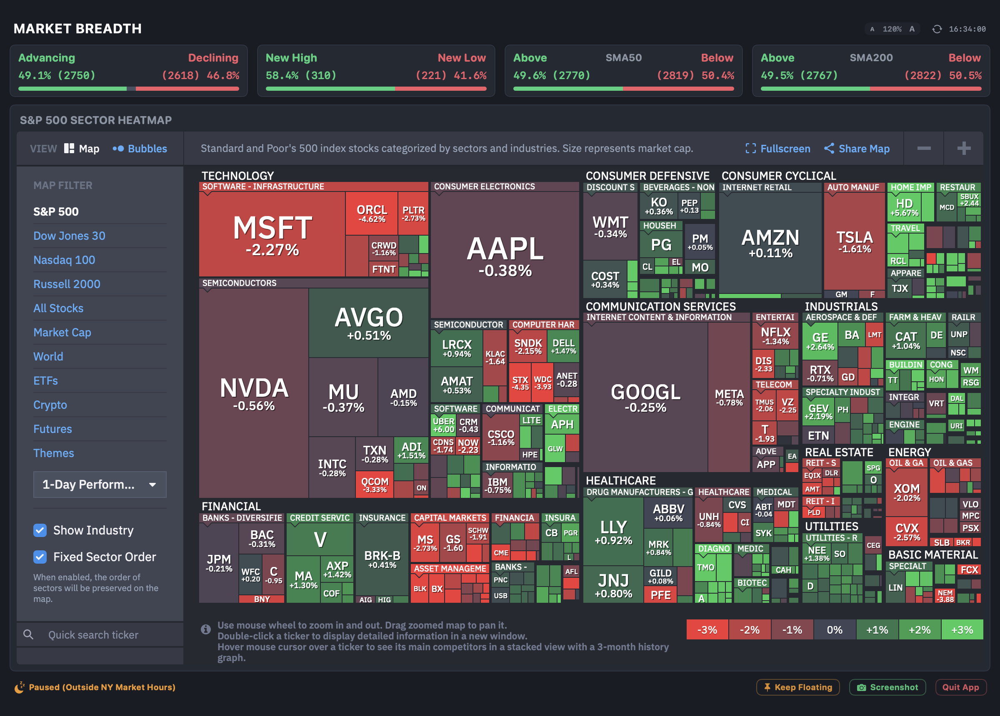

# 📊 MarketWatch: Real-Time macOS Menu Bar Dashboard

A lightweight, premium native macOS status bar application that monitors critical market breadth metrics and integrates the interactive Finviz S&P 500 Sector Map. It displays a real-time summary directly in your status menu bar, which opens a high-fidelity visual dashboard panel upon clicking.

Built entirely in native Swift, Cocoa, and SwiftUI with **zero external dependencies**, compiling into an extremely optimized, standalone executable that runs in accessory mode (hidden from the Dock) and consumes near-zero system resources.


---

## ✨ Key Features

*   **📈 Dynamic Status Bar Summary:** Displays the live advancing stock percentage directly in your menu bar (e.g. `📊 49.2%`). Clicking the status bar indicator toggles the visual dashboard.
*   **🎨 2-Row Visual Layout:**
    *   **Row 1 (Top):** Displays four horizontal breadth metric cards tiled side-by-side, each stretching dynamically to cover the dashboard width:
        1.  **`Advancing / Declining`:** NYSE/Nasdaq/AMEX advancing vs. declining stocks ratio and segmented progress bar.
        2.  **`New High / New Low`:** Stocks hitting 52-week highs vs. 52-week lows.
        3.  **`Above SMA50`:** Percentage of stocks trading above their 50-day Simple Moving Average.
        4.  **`Above SMA200`:** Percentage of stocks trading above their 200-day Simple Moving Average.
    *   **Row 2 (Bottom):** Spans the interactive **Finviz S&P 500 Sector Heatmap** wrapped in a custom web view, giving real-time visualization of sector flows.
*   **🧹 Advert-Free Web Canvas:** Injects custom CSS stylesheets to remove webpage headers, navbars, notices, footers, and advertisement slots, leaving only the clean, full-screen map, its zoom controls, and checkboxes.
*   **⚡ Continuous JS Layout Overrides:** Programmatically forces the web page's canvas wrapper height to match the viewport size and dispatches window resize events continuously, keeping the bottom color legend (`-3%` to `+3%`) and zoom instructions fully visible.
*   **📌 Detachable Glassmorphic HUD Window:** Tapping `Keep Floating` in the footer detaches the dashboard from the status bar into a borderless floating utility window (`NSPanel`) with a native macOS glassmorphic blur backdrop (`NSVisualEffectView`) that stays on top of other workspace windows.
*   **📷 Clipboard-Only Screenshots:** Captures the entire dashboard, copies it instantly to the macOS clipboard, triggers a green success toast indicator, and issues a standard system chime (no cluttering local disk files).
*   **🌙 NYSE Hours Integration & Sleeping Indicator:** Detects whether the NY Stock Exchange is active. Skips background fetches outside market hours to save network calls, displaying an amber sleeping moon (`moon.zzz.fill`) paused label.
*   **🎛️ Dynamic Scaling:** Top header font controls dynamically scale all dashboard components (text, progress bars, map viewport) between `80%` and `140%` smoothly, persisting your choice via `@AppStorage`.
*   **⚡ Ultra-Light Footprint:** Performs parallel network queries using Combine's asynchronous publisher pipeline. Operates at **0.0% CPU** in the background, consuming **less than 50 MB of RAM**.

---

## 📂 Project Architecture

The application is completely self-contained in the following core files:

*   **[Parser.swift](file:///Users/vikasbhatia/code/marketwatch/Parser.swift):** Core models (`MarketBreadthItem`, `MarketIndexData`) and the network fetching engine (`MarketBreadthFetcher`) executing parallel URLSession pipelines.
*   **[FinvizMapView.swift](file:///Users/vikasbhatia/code/marketwatch/FinvizMapView.swift):** WKWebView component configured with User Agent customization, dark theme overrides, clean CSS injections, and runtime height alignment listeners.
*   **[BreadthViews.swift](file:///Users/vikasbhatia/code/marketwatch/BreadthViews.swift):** High-fidelity SwiftUI visual modules, horizontal breadth cards, interactive layout controls, and footer actions.
*   **[AppDelegate.swift](file:///Users/vikasbhatia/code/marketwatch/AppDelegate.swift):** Core status item lifecycle, NSPopover controls, AppKit `NSPanel` floating window controller, and screenshot copying procedures.
*   **[main.swift](file:///Users/vikasbhatia/code/marketwatch/main.swift):** Accessories mode entry hook initializing the AppKit environment loop.
*   **[build.sh](file:///Users/vikasbhatia/code/marketwatch/build.sh):** Programmatic compilation script invoking Apple's native Swift compiler (`swiftc`) linked to Cocoa system libraries.
*   **[install_launch_agent.sh](file:///Users/vikasbhatia/code/marketwatch/install_launch_agent.sh):** Automation script that registers, compiles, and registers a background Launch Agent daemon.

---

## 🛠️ Compilation & Setup

To compile the standalone binary on any modern macOS machine:

1. Open your Terminal and navigate to the project directory:
   ```bash
   cd /Users/vikasbhatia/code/marketwatch
   ```
2. Execute the compilation script:
   ```bash
   ./build.sh
   ```

---

## 🚀 How to Run

### 1. Launch in Background (Default 5-Minute Refresh)
```bash
./MarketWatch &
```

### 2. Launch with a Custom Refresh Interval (e.g., Every 120 Seconds)
```bash
./MarketWatch -i 120 &
```
*(Programmatically enforces a minimum safety threshold of 10 seconds to protect against rate-limiting).*

### 3. Setup Auto-Start on Boot / Login (macOS Launch Agent)
To register the app so that it starts automatically in the background whenever your Mac boots up or you log in:
```bash
chmod +x install_launch_agent.sh
./install_launch_agent.sh
```
*(This sets up a plist Launch Agent under `~/Library/LaunchAgents/com.marketwatch.plist` that supervises, automatically restarts, and runs the application background loops).*

---

## 🕹️ Controls & Interaction

1.  **Status Bar:** Look at the top-right of your screen for the dynamic indicator (e.g. `📊 49.2%`). Click it to open the dashboard.
2.  **Detached Mode:** Click the `pin.fill` **Keep Floating** button in the footer to pop the dashboard out into a floating glass panel. Move it anywhere on your desktop. Click it again to snap it back.
3.  **Visual Spring Scale:** Hovering over any card tile expands it (+2% scale) and intensifies the dynamic glassmorphic radial background glow (green for bullish, red for bearish).
4.  **Screenshot Sharing:** Click the `📷 Screenshot` button in the footer to copy the dashboard directly to your clipboard for instant pasting into Slack, iMessage, or mail applications.
5.  **Quit:** Click the `Quit App` button in the footer (visible in Popover mode) or click the close traffic light on the HUD Panel to exit the application cleanly.
